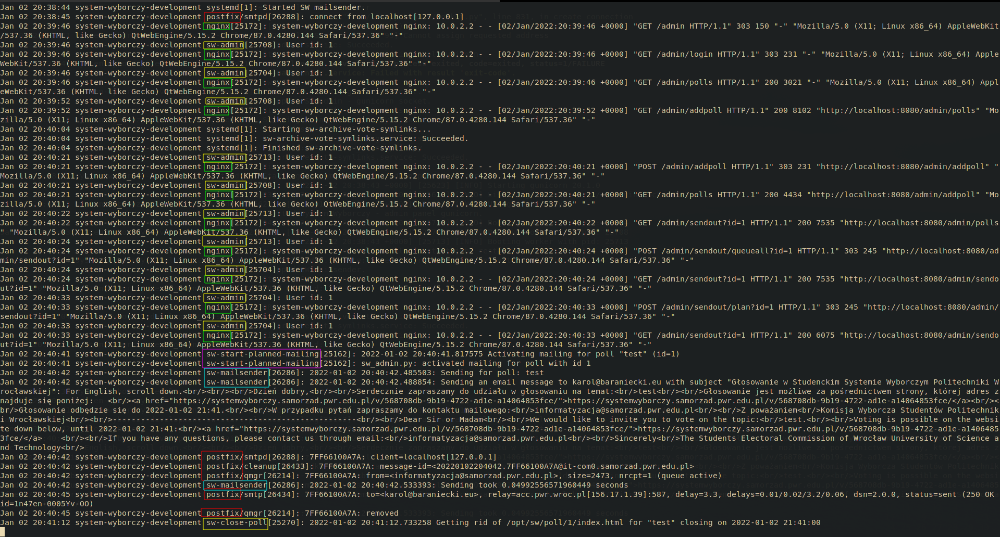

# System Wyborczy v2


## Uruchamianie (Linux, macOS, Windows)

Aby uruchomić developerską wersję Systemu Wyborczego potrzebny jest [Vagrant](https://www.vagrantup.com/).

```bash
$ git clone https://github.com/informatyzacja-sspwr-projekty/SWv2.git
$ cd SWv2
$ vagrant up
```

Wykonanie tych komend stworzy maszynę wirtualną w której będą włączone wszystkie komponenty Systemu.

Po wykonaniu strona administratora powinna być dostępna na [http://localhost:8080/admin](http://localhost:8080/admin), z loginem `admin` i hasłem `haker7`, a komenda `vagrant ssh` powinna otworzyć shell na maszynie wirtualnej.

Aby wyłączyć maszynę wirtualną po skończeniu pracy można wykonać:

```bash
$ vagrant halt
```

## Logi i status


Aby zobaczyć status wszystkich usług należy w shellu otwartym przez `vagrant ssh` wykonać:

```bash
$ sw-status
```

Aby zobaczyć status jednej usługi można użyć `systemctl` z `systemd` (w shellu otwartym przez `vagrant ssh`):

```bash
$ systemctl status sw-close-poll
```

Aby zobaczyć logi wszystkich komponentów w czasie rzeczywistym należy w shellu otwartym przez `vagrant ssh` wykonać:

```bash
$ sw-logs
```



kolorami zaznaczone są nazwy usług systemu

Aby zobaczyć logi jednej usługi można użyć `journalctl` z `systemd` (w shellu otwartym przez `vagrant ssh`):

```bash
$ journalctl --pager-end --unit=sw-close-poll
$ # lub, krócej
$ journalctl -e -u sw-close-poll
```

lub, aby zobaczyć logi skrolujące w czasie rzeczywistym (w shellu otwartym przez `vagrant ssh`):

```bash
$ journalctl --lines=all --follow --unit=sw-close-poll
$ # lub, krócej
$ journalctl -n all -f -u sw-close-poll
```

Aby zrestartować wszystkie usługi (przy zmianie kodu w pythonie) (w shellu otwartym przez `vagrant ssh`):

```bash
$ sw-restart
```

lub, aby zrestartować jedną usługę z użyciem `systemctl` z `systemd` (w shellu otwartym przez `vagrant ssh`):

```bash
$ systemctl restart sw-close-poll
```

## Komponenty

### [`sw-admin`](./sw-admin)

Aplikacja we Flasku z panelem administratora

### [`sw-archive-vote-symlinks`](./sw-archive-vote-symlinks)

Usługa pozbywająca się tokenów z zamkniętych głosowań

### [`sw-close-poll`](./sw-close-poll)

Usługa zamykająca głosowania gdy ich czas zakończenia nadejdzie

### [`sw-database`](./sw-database)

Opis i skrypty dla bazy danych Postgresql

### [`sw-mailsender`](./sw-mailsender)

Usługa wysyłająca maile dla głosujących

### [`sw-openresty`](./sw-openresty)

Serwer HTTP(s)

### [`sw-postfix`](./sw-postfix)

Serwer SMTP przekazujący maile od [`sw-mailsender`](./sw-mailsender) do WCSS

### [`sw-start-planned-mailing`](./sw-start-planned-mailing)

Usługa rozpoczynająca zaplanowaną w czasie wysyłkę maili

