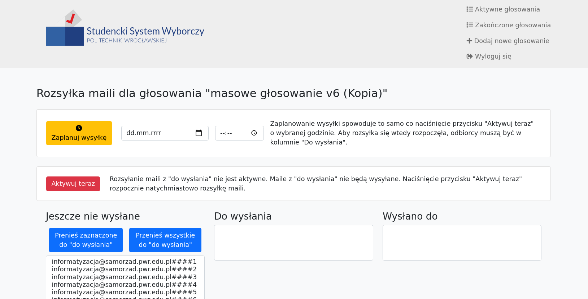

# sw-admin


`sw-admin` jest backendem w napisanym w Pythonie z wykorzystaniem frameworka Flask, który odpowiada za podstrony `/admin` w SW.

Na serwerze produkcyjnym `sw-admin` jest uruchamiany za pomocą narzędzia [Gunicorn](https://gunicorn.org/), co pozwala mu działać w kilku procesach jednocześnie oraz prosty sposobem być wywoływanym z Openresty.

Katalog `templates/` zawiera kod HTML dla każdej podstrony. Wykożystane są domyślne templatki z Flaska - biblioteka `Jinja2` oraz Bootstrap.

## Interakcja z resztą systemu


## Zaimplementowane funkcjonalności

### Logowanie się na różne konta administratorów - `/admin/login`

| Interfejs                   |
:-----------------------------:
|  |

Logowanie jest zrealizowane z użyciem Flaskowego `LoginManager`. Każda funkcja ubrana w `@login_required` przekierowuje do `/admin/login` jeżeli uzytkownik nie jest zalogowany. ID zalogowanego użytkownika odpowiadające ID w bazie danych można uzyskać wywołując `current_user.get_id()`.

Przekierowanie niezalogowanych użytkowników jest zrealizowane w taki sposób:

```python
@login_manager.unauthorized_handler
def unauthorized():
    return redirect('/admin/login', code=303)
```

Uwaga! Adnotacja `@login_required` musi występować poniżej adnotacji `@app.route('...')` - jeżeli wystąpi linijkę wyżej nie ma ona żadnego efektu. Przykład:

```python3
# bad code - everyone can see this regardless of whether they are logged in or not
@login_required
@app.route('/admin/addpoll', methods=['GET'])
def admin_addpoll():
    return render_template('addpoll.html')
```

```python3
# good code - only logged in users can see this
@app.route('/admin/addpoll', methods=['GET'])
@login_required
def admin_addpoll():
    return render_template('addpoll.html')
```

Otwarcie strony `/admin/login` wywołuje funkcję `admin_login()` w Pythonie. Naciśnięcie na guzik "Zaloguj się" wywołuje `admin_login_post()`.

Templatka HTML dla logowania: [templates/login.html](templates/login.html). Rozszerza templatkę [templates/base.html](templates/base.html).

---

### Wyświetlanie aktywnych głosowań - `/admin/polls`

| Interfejs                   |
:-----------------------------:
|  |

Strona wyświetla listę głosowań z bazy danych (tabela `polls`), które:

- nie są zakończone (`closed=false` w bazie danych)
- są stworzone przez użytkownika który jest zalogowany (`owner_user` w bazie danych jest równe ID użytkownika zalogowanego)

Funkcja w pythonie reagująca na otwarcie strony: `admin_polls()`

Templatka HTML: [templates/polls.html](templates/polls.html) (z parametrem `closed=False`) - rozszerza [templates/baseloggedin.html](templates/baseloggedin.html) która rozszerza [templates/base.html](templates/base.html).

---

### Wyświetlanie zakończonych głosowań - `/admin/closedpolls`

| Interfejs                         |
:-----------------------------------:
|  |

Strona wyświetla listę głosowań z bazy danych (tabela `polls`), które:

- są zakończone (`closed=true` w bazie danych)
- są stworzone przez użytkownika który jest zalogowany (`owner_user` w bazie danych jest równe ID użytkownika zalogowanego)

Funkcja w pythonie reagująca na otwarcie strony: `admin_closedpolls()`

Templatka HTML: [templates/polls.html](templates/polls.html) (z parametrem `closed=True`) - rozszerza [templates/baseloggedin.html](templates/baseloggedin.html) która rozszerza [templates/base.html](templates/base.html).

---

### Tworzenie głosowań - `/admin/addpoll`

| Interfejs                         |
:-----------------------------------:
|      |

Dodaje nowe głosowanie z `owner_user` ustawionym jako ID aktualnie zalogowanego użytkownika.

Funkcja w pythonie reagująca na otwarcie strony: `admin_addpoll()`

Funkcja w pythonie reagująca na naciśnięcie przycisku "Dodaj głosowanie": `admin_addpoll_post()`

Templatka HTML: [templates/addpoll.html](templates/addpoll.html) - rozszerza [templates/baseloggedin.html](templates/baseloggedin.html) która rozszerza [templates/base.html](templates/base.html).

---

### Edytowanie głosowań - `/admin/editpoll?id={poll_id}`

| Interfejs                         |
:-----------------------------------:
|     |

Pozwala na edytowanie głosowania z id `poll_id`. Przed wykonaniem czegokolwiek sprawdza czy głosowanie należy do aktualnie zalogowanego użytkownika (`owner_user`).

Logika jest bardzo podobna co przy dodawaniu głosowania (`/admin/addpoll`) - z takimi różnicami że wartości w interfejsie są od razu załadowane z tabeli `polls`, a naciśnięcie przycisku "Zapisz głosowanie" nie tworzy nowego głosowania ale modyfikuje już istniejące.

Funkcja w pythonie reagująca na otwarcie strony: `admin_editpoll()`

Funkcja w pythonie reagująca na naciśnięcie przycisku "Zapisz głosowanie": `admin_editpoll_post()`

Templatka HTML: [templates/editpoll.html](templates/editpoll.html) - rozszerza [templates/baseloggedin.html](templates/baseloggedin.html) która rozszerza [templates/base.html](templates/base.html).

---

### Duplikowanie głosowań - `/admin/copypoll?id={poll_id}`

| Interfejs                         |
:-----------------------------------:
|     |

Duplikowanie głosowania wypełnia wartości w interfejsie tak jak edytowanie głosowania, jednak naciśnięcie przycisku "Dodaj głosowanie" na dole strony powoduje dodanie nowego głosowania zamiast edycji istniejącego.

Funkcja w pythonie reagująca na otwarcie strony: `admin_copypoll()`

Rekacja na przycisk wykorzystuje logikę dodawania głosowania - jest to `POST` do `/admin/addpoll` wywołujący `admin_addpoll_post()`.

Templatka HTML: [templates/copypoll.html](templates/copypoll.html) - rozszerza [templates/editpoll.html](templates/editpoll.html) która rozszerza [templates/baseloggedin.html](templates/baseloggedin.html) która rozszerza [templates/base.html](templates/base.html).

---

### Podgląd strony dla głosującego - `/admin/peek?id={poll_id}`

| Interfejs                         |
:-----------------------------------:
|      |

Podgląd strony wykorzystuje tą samą logikę jak generacja pliku `/opt/sw/poll/{poll_id}/index.html` przy starcie wysyłki maili, jedynie ze zmienioną ścieżką. Dlatego przy podglądzie generowany jest plik `/opt/sw/poll/{poll_id}/index-peek.html`, po czym jest on czytany i zwracany do przeglądarki. 

Funkcja w pythonie: `look_at_poll()`

Funkcja w pythonie nie robiąca nic oprócz przekierowania użytkownika do listy głosowań, ale reagująca na przycisk "Głosuj" naciśnięty przy podglądzie: `admin_peek_vote()`.

Templatka HTML: [templates/vote.html](templates/vote.html) - rozszerza [templates/base.html](templates/base.html).


---

### Rozsyłka maili - `/admin/sendout?id={poll_id}`

Interfejs rozsyłki maili zależy od stanu w jakim znajduje się głosowanie.

Funkcja w pythonie reagująca na wejście na stronę: `admin_sendout()`

Interfejs w zależności od stanu głosowania w bazie danych:

| `closed` | `mailing_active` | `planned_start_sending` | Interfejs                       |
:---------:|:----------------:|:-----------------------:|:--------------------------------:
| `false`  | `false`          | `NULL`                  |    |
| `false`  | `false`          | `not NULL`              |   |
| `false`  | `true`           | *cokolwiek*             |   |
| `true`   | *cokolwiek*      | *cokolwiek*             |   |

Przyciski w widoku rozsyłki maili:

<table>
    <tr>
        <th>Przycisk <br/> Akcja POST i funkcja ją obsługująca</th>
        <th>Co dzieje się po naciśnięciu</th>
    </tr>
    <tr>
        <td align="center">
            
            <br/> Akcja: <code>/admin/sendout/plan?id={poll_id}</code>
            <br/> Funkcja: <code>admin_sendout_plan_post()</code>             
        </td>
        <td>
            <ul>
                <li>
                    <code>planned_start_sending</code> głosowania jest ustawione na podaną datę/godzinę (w strefie czasowej <code>Europe/Warsaw</code>)
                </li>
            </ul>
            <br/>
            Gdy minie zaplanowana godzina, <strong><code>sw_start_planned_mailing.py</code></strong> automatyczine zaimportuje <strong><code>sw_admin.py</code></strong>
            i wywoła <code>activate_mailing()</code> symulując naciśnięcie na guzik "Aktywuj teraz", rozpoczynając głosowanie.
        </td>
    </tr>
    <tr>
        <td align="center">
            
            <br/> Akcja: <code>/admin/sendout/unplan?id={poll_id}</code>
            <br/> Funkcja: <code>admin_sendout_unplan_post()</code>           
        </td>
        <td>
            <ul>
                <li> <code>planned_start_sending</code> głosowania jest ustawione na <code>NULL</code> </li>
            </ul> 
        </td>
    </tr>
    <tr>
        <td align="center">
            
            <br/> Akcja: <code>/admin/sendout/activatemailing?id={poll_id}</code>
            <br/> Funkcja: <code>admin_sendout_activatemailing_post()</code>  
        </td>
        <td>
            <ul>
                <li> Katalogi <code>/opt/sw/poll/{poll_id}/</code> oraz <code>/opt/sw/poll/{poll_id}/results/</code> są tworzone jeżeli nie istnieją </li>
                <li> Plik <code>/opt/sw/poll/{poll_id}/index.html</code> jest tworzony, generowany na podstawie templatki <a href="templates/vote.html">templates/vote.html</a> </li>
                <li> <code>mailing_active</code> głosowania jest ustawione na <code>true</code> </li>
                <li> <code>planned_start_sending</code> głosowania jest ustawione na <code>NULL</code> </li>
            </ul> 
            <br />
            Ta funkcjonalność (<code>activate_mailing()</code> z sw_admin.py) jest też wywoływana przez <strong><code>sw_start_planned_mailing.py</code></strong>
            gdy <code>planned_start_sending</code> jest ustawiony na datę/godzinę która nadeszła
        </td>
        </td>
    </tr>
    <tr>
        <td align="center">
            
            <br/> Akcja: <code>/admin/sendout/deactivatemailing?id={poll_id}</code>
            <br/> Funkcja: <code>admin_sendout_deactivatemailing_post()</code>
        </td>
        <td>
            <ul>
                <li> <code>mailing_active</code> głosowania jest ustawione na <code>false</code> </li>
            </ul> 
        </td>
    </tr>
    <tr>
        <td align="center">
            
            <br/> Akcja: <code>/admin/sendout/queueall?id={poll_id}</code>
            <br/> Funkcja: <code>admin_sendout_queueall_post()</code>         
        </td>
        <td>
            <ul>
                <li>Tablica adresów email <code>sending_out_to</code> dla głosowania zostaje ustawiona na zawartość tablicy <code>possible_recipients</code></li>
            </ul>
        </td>
    </tr>
    <tr>
        <td align="center">
            
            <br/> Akcja: <code>/admin/sendout/queueselected?id={poll_id}</code>
            <br/> Funkcja: <code>admin_sendout_queueselected_post()</code>    
        </td>
        <td>
            <ul>
                <li>Wybrane adresy email zostają dodany do tablicy adresów <code>possible_recipients</code></li>
            </ul>
        </td>
    </tr>
</table>

Jakie adresy email znajdują się na listach w interfejsie:

| Lista | Adres znajduje się w `possible_recipients` | Adres znajduje się w `sending_out_to` | Adres znajduje się w `sent_to` |
:-------------------------------------:|:---:|:---:|:----:
|  | :heavy_check_mark: | :x: | :x: |
|  | :heavy_check_mark: | :heavy_check_mark: | :x: |
|  | :heavy_check_mark: | :heavy_check_mark: | :heavy_check_mark: |

Dla klaryfikacji tabelki: w "Wysłano do" wyświetlają się adresy które są we wszystkich trzech tablicach, a w "Jeszcze nie wysłane" adresy które są jedynie w `possible_recipients`.

---

### Wyniki głosowania - `/admin/results?id={poll_id}`


| Interfejs                         |
:-----------------------------------:
|      |

Wyniki głosowania są liczone przez skrypt [`countvotes.sh`](./countvotes.sh) przy otwarciu strony z wynikami.
Głosy są zapisane w osobnych plikach w katalogu `/opt/sw/polls/{poll_id}/results/`. Skrypt czyta każdy plik w tym katalogu i podaje wyniki, które są pokazywane na stronie.

**Format plików z głosami**

Przykład pliku z głosem gdzie głosujący wybrał opcje `0` ("Jan Kowalski"), `2` ("Jan Nowak"), oraz `13` ("Adam Nowak") (pierwsza linijka pusta):

```

option_0=Jan%20Kowalski&option_2=Jan%20Nowak&option_13=Adam%20Nowak
```

Przykład pliku gdzie głosujący wybrał jedynie opcję 1 ("Jan Nowakowski"):

```

option_1=Jan%20Nowakowski
```

Przykład pliku gdzie głosujący oddał pusty głos (pusty plik):

```


```

Funkcja w pythonie reagująca na otwarcie strony: `admin_results()`

Templatka HTML: [templates/results.html](templates/results.html) - rozszerza [templates/baseloggedin.html](templates/baseloggedin.html) która rozszerza [templates/base.html](templates/base.html).
