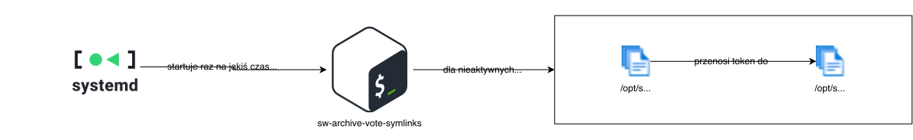

# sw-archive-vote-symlinks 

Skrypt archiwizujący tokeny z `/opt/sw/v/` które pokazują na głosowania które się już zakończyły - czyli nie są dowiązaniami symbolicznymi pokazującymi na głosowania które posiadają `index.html`.

Dla bezpieczeństwa i możliwości odkręcenia wadliwego działania skryptu tokeny nie są usuwane z `/opt/sw/v/`, a jedynie przenoszone do `/opt/sw/v-archive/`

Takie tokeny istnieją kiedy głosowanie zostanie zakończone, a nie wszyscy głosujący oddadzą głos.

Ponieważ listowanie plików w katalogu robi się wolne z dużą ilością plików, ten skrypt pomaga utrzymaniu szybkiego działania systemu.

## Interakcje z resztą systemu

