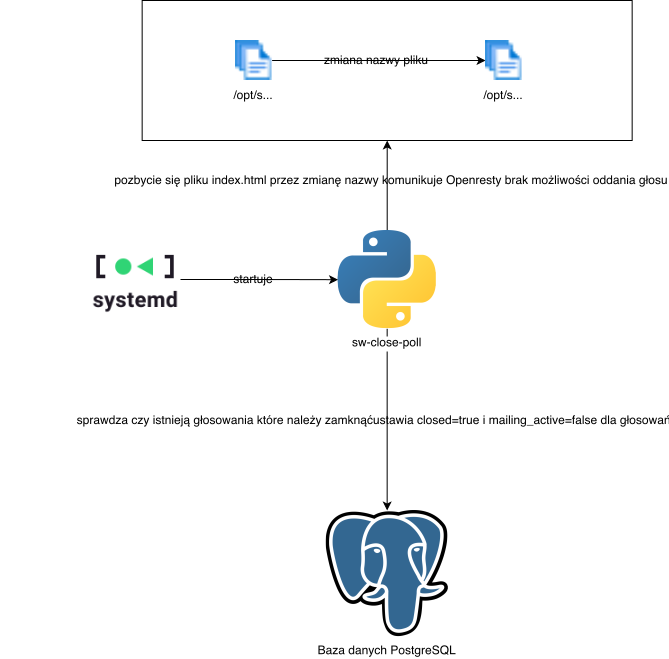

# sw-close-poll 

Skrypt zamyka głosowanie po nastaniu godziny zakończenia głosowania, poprzez:

- Ustawienie `closed` na `false` w bazie danych:
    - Przenosi głosowanie w `sw-admin`ie do "Zakończonych głosowań"
    - Nie pozwala rozpoczynać głosowania ponownie w `sw-admin`ie.

- Pozbycie się pliku `/opt/sw/poll/{poll_id}/index.html`
    - Nie pozwala wyświetlić strony z kandydatami osobom głosującym (`Openresty`)
    - Nie pozwala na oddawanie głosów (`Openresty`)

## Interakcja z resztą systemu

