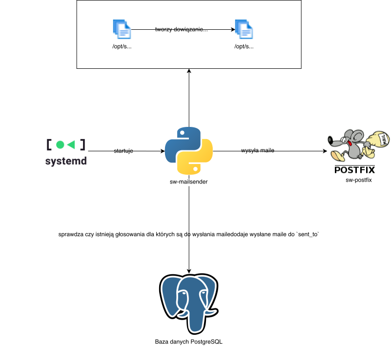

# sw-mailsender 

`sw-mailsender` tworzy tokeny oraz wysyła maile dla głosowań.

Wysyłka jest przeprowadzana dla każdego głosowania, które:

- nie jest zamknięte (`closed=false`),
- ma aktywną wysyłkę maili (`mailing_active=true`),
- posiada adresy email do których należy wysłać wiadomość (są w `sending_out_to`) do których wiadomość nie została jeszcze wysłana wysłana (nie ma ich w `sent_to`)

Dla tych głosowań prędkością około 3.5 maila/sekundę (łącznie dla wszystkich głosowań - aby nie przekroczyć limitu narzuconego przez serwer WCSS) dla każdego adresu odbiorcy:

- generowany jest token UUID - zapamiętywany poprzez utworzenie dowiązania symbolicznego `/opt/sw/v/{token}` pokazującego na głosowanie `/opt/sw/poll/{poll_id}/`. Dzięki temu [sw-openresty](../sw-openresty) może wyświetlić odpowiednią stronę z odpowiednim index.html po wejściu na link, oraz może zapisać oddany głos do odpowiedniego głosowania
- generowana jest wiadomość email i przekazana do [Postfixa](../sw-postfix)

## Interakcja z resztą systemu

